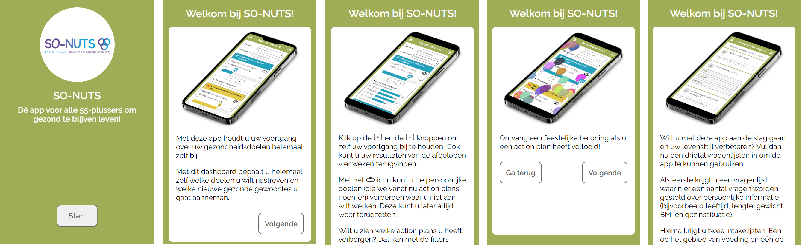
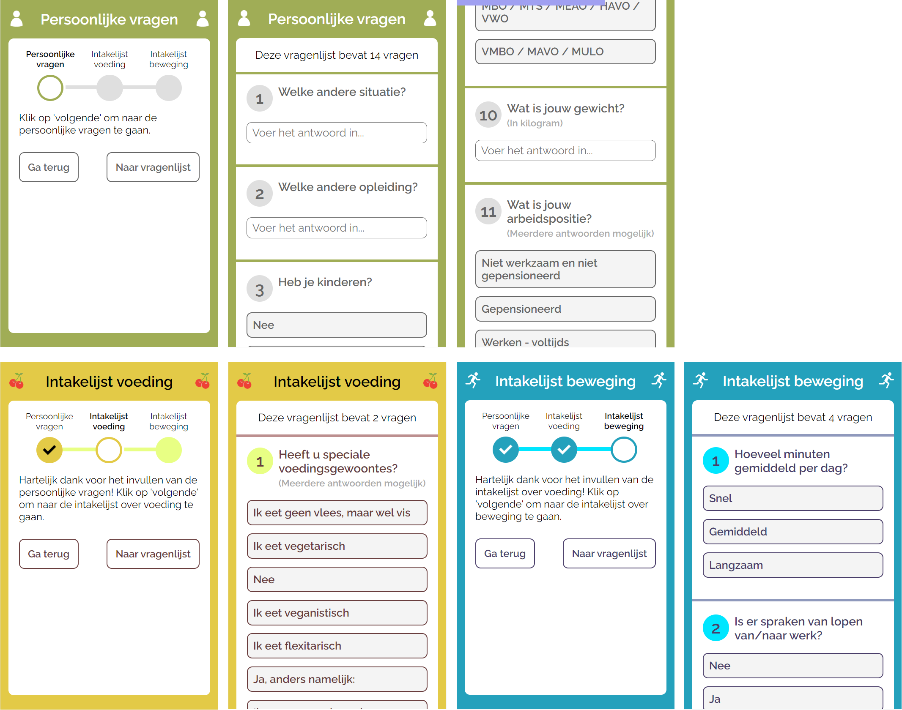
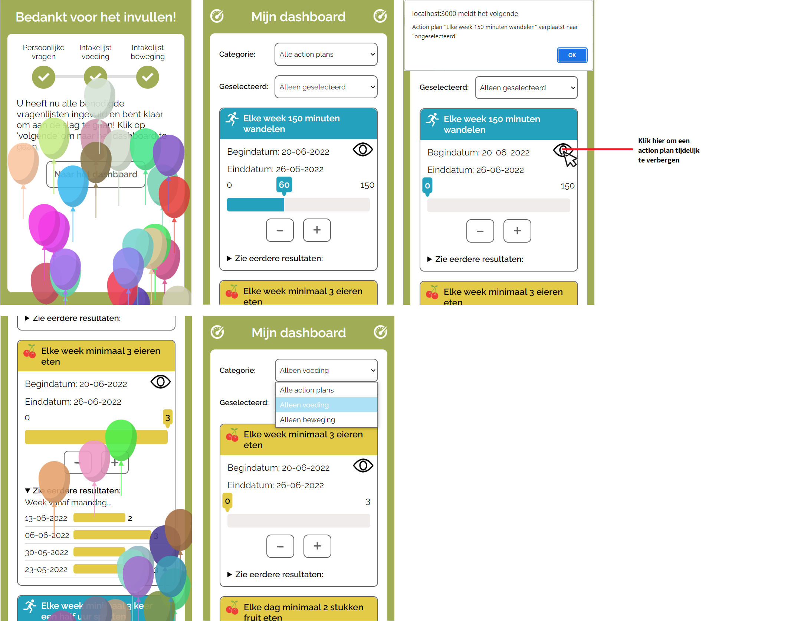
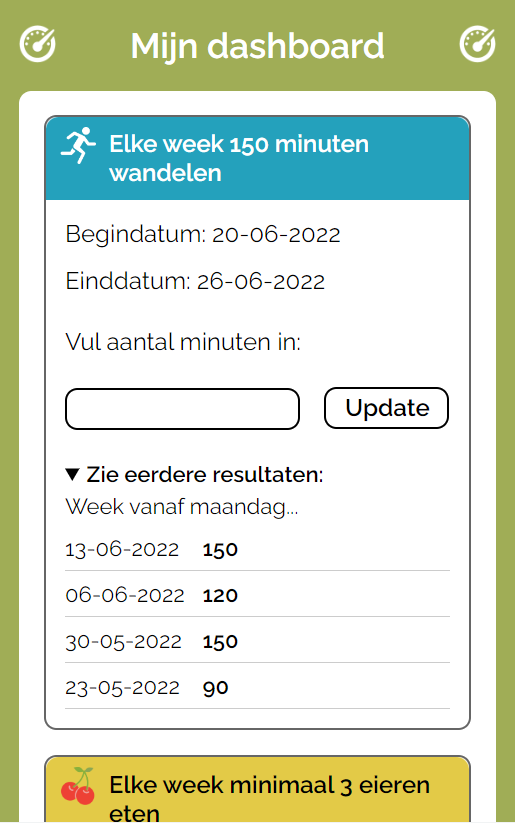
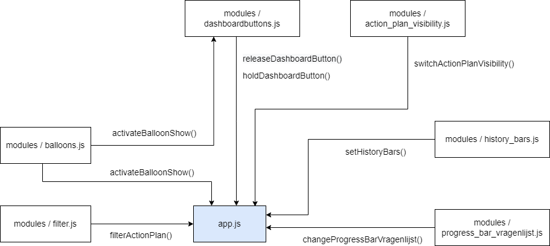
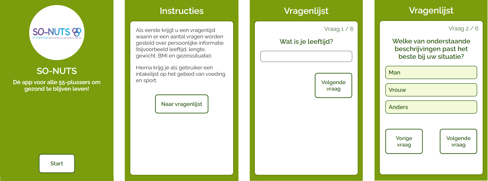
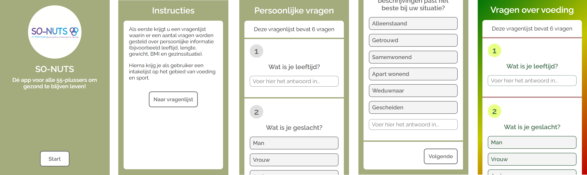
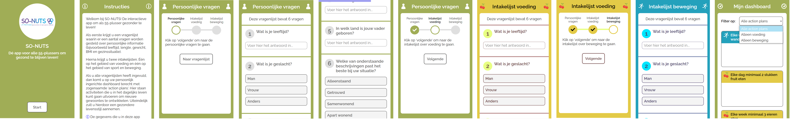
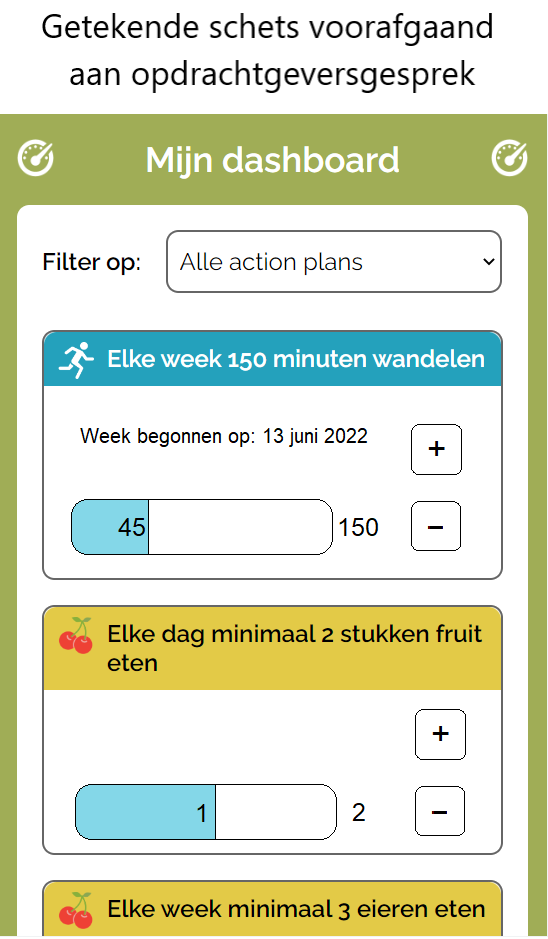

# SO-NUTS web app
Dit project bevat een web app voor het project SO-NUTS. Dit project is bedoeld voor 55-plussers om gezond te blijven leven op het gebied van voeding en beweging. De app bevat een aantal vragenlijsten waar de gebruiker doorheen dient te lopen. Na het beantwoorden van alle vragen krijgt de gebruiker de optie om uit verschillende zogenaamde intakelijsten te kiezen. Het doel van de app is om de mensen nieuwe (gezondere) gewoontes te laten creëren.

Bij dit project is gebruikgemaakt van HTML, CSS, JavaScript, Express, ejs en Node.js Ook is er gebruikgemaakt van een externe API om data op te halen waaruit de vragenlijsten worden gegenereerd.

Link naar live project: https://so-nuts-500895931.herokuapp.com/

## Design Rationale
### Debriefing
Hieronder staat de debriefing die alle studenten, die voor de opdracht SO-NUTS hebben gekozen, gezamenlijk in de eerste week hebben opgesteld:

#### Contactgegevens
Bedrijfsnaam:	Chippr
Contactpersoon:	Wouter Lem
E-mailadres:	office@chippr.dev
Telefoonnummer:	+31 6 24 58 23 49
Adres:			Kanaalweg 29C, 3526 KM Utrecht

#### Achtergrondinformatie
SO-NUTS is een Europees samenwerkingsverband van experts op het gebied van voeding, beweging, eHealth, sarcopenie, obesitas en sarcopenie obesitas. Met SO-NUTS leveren onderzoekers een belangrijke bijdrage aan de (internationale) kennis over de preventie van sarcopene obesitas bij groeiende groepen ouderen. SO-NUTS wordt uitgevoerd door de onderzoeksgroep "People in Motion" binnen de HvA. People in Movement is een samenwerking tussen de drie HvA-opleidingen (FG), Bewegen, Sport en Voeding (FBSV), Digitale Media en de Creatieve Industrie (FDMCI).

#### Opdrachtomschrijving
Bij deze opdracht is het de bedoeling dat er een web applicatie wordt ontwikkeld waarbij 55-plussers gestimuleerd worden om een duurzaam beweeg- en voedingspatroon aan te houden. De persoon in kwestie moet op de app drie vragenlijsten kunnen invullen zodat er op basis van de antwoorden twee lijsten met aanbevelingen kunnen worden gedaan. Deze aanbevelingen zijn gericht op het verbeteren van het voedingspatroon en op het verbeteren van je actieve levensstijl. Vervolgens moet de app de gebruiker laten kiezen uit drie onderwerpen. Hier moet de gebruiker een planning voor kunnen maken, zodat de app tips aan de gebruiker tips kan geven over het aanleren van nieuwe gewoontes in zijn/haar levensstijl.

#### Aanleiding
Ouder worden heeft gevolgen op mensen hun leefstijl. Onder andere hun eet- en beweeggewoonten veranderen. Soms kan dit betekenen dat mensen extra gewicht krijgen, met name in vetmassa, terwijl de spiermassa juist afneemt. Er zijn al oplossingen om mensen op een aantrekkelijke, gepersonaliseerde en goedkope manier hulp te bieden. Toch ontbreekt het aan effectieve, duurzame eet- en beweeginterventies gericht op onze specifieke doelgroep: 55-plussers.

#### Doelstelling
Wanneer mensen ouder worden gaan verandert er veel in hun leven. Zo ook het eetpatroon en de dagelijkse beweging kan erg veranderen. Zo kan iemand die een actieve baan had, opeens veel minder gaan bewegen waardoor de vetmassa kan toenemen en de spiermassa afneemt. Dit allemaal is natuurlijk niet bevorderlijk voor de gezondheid van de mens. Er is en grote hoeveelheid aan applicaties en wearables die mensen kunnen stimuleren om meer te gaan bewegen en bewuster te gaan eten. Dit wordt ook wel eHealth genoemd.

Helaas ontbreekt het aan effectieve, duurzame eet-en beweeginterventies voor mensen die ouder worden. Het is aan ons om ervoor te zorgen dat er een digitale tool komt die 55-plussers stimuleren om meer te bewegen en een meer bewust voedingspatroon in hun leven te implementeren zodat sarcopenie, obesitas en sarcopene obesitas voorkomen kunnen worden.

#### Oplevering
Elke vrijdag* laten de studenten de voortgang van hun producten zien aan de opdrachtgever Chippr en kan er feedback worden gegeven. Op vrijdag 24 juni 2022 worden de eindproducten opgeleverd en gepresenteerd op een expositie.
*Later aangepast naar elke maandag.

#### Randvoorwaarden
De enige randvoorwaarde is een digitale tool dat een duurzaam beweeg- en voedingspatroon stimuleert, voor 55-plussers.

#### Gebruikers van het eindresultaat
55-plussers zullen de gebruikers van het eindresultaat worden.

#### Relatie met andere projecten
Het project SO-NUTS heeft geen relatie met andere projecten.

Voor verdere informatie, zie https://www.digitallifecentre.nl/projecten/so-nuts.

### De probleem-definitie
Zoals hierboven al beschreven, zijn er al veel apps en andere hulpmiddelen op de markt die mensen stimuleren om gezonder te eten en meer te bewegen. Alleen zijn er volgens Chippr nog niet echt goede oplossingen op de markt die specifiek gericht zijn op mensen van 55 jaar en ouder. Mensen in deze groep die na enkele jaren met pensioen zullen gaan, zullen naar verwachting namelijk veel minder bewegen en ongezonder eten.

### De oplossing
De oplossing die ik heb gerealiseerd, is een web-applicatie die uit verschillende delen is opgebouwd:

Na het homescherm is de onboarding, bestaande uit vier schermen, het eerste wat je als potentiële gebruiker te zien krijgt.
Zie de schermen hieronder:

Hierna komt de gebruiker bij de vragenlijsten terecht over personalia, voeding en beweging. Alle antwoorden worden direct (zonder client-side JavaScript) op de server opgeslagen zodra de gebruiker naar de volgende vragenlijst gaat.
Zie de schermen hieronder:

Als de gebruiker dan eindelijk door die lange vermoeiende vragenlijsten heen is, krijgt hij/zij nog een feestelijke beloning in de vorm van een ballonnenshow te zien waarna diegene het dashboard kan openen. Op dit dashboard staan alle zogenaamde 'action plans' waarbij de gebruiker zelf kan kiezen aan welke hij/zij wel en niet meedoet. Je kunt hierbij filters aanzetten om alleen specifieke action plans te tonen en wanneer je een action plan voltooid hebt, krijg je opnieuw die super gave beloning te zien. Ook kan je als gebruiker je resultaten per action plan van de afgelopen vier weken inzien.
Zie de schermen hieronder:

Wanneer de gebruiker op het dashboard terechtkomt en JavaScript is uitgeschakeld, dan ziet het dashboard er zo uit:

Een stukje soberder dus, maar het functioneert nog steeds. De filters werken niet en zijn onzichtbaar gemaakt. Er zal geen ballonnenshow opduiken als er een action plan wordt voltooid en bij de vragenlijsten werkt de progress bar niet.

#### Verband met user stories
Voorafgaand aan het project heeft de opdrachtgever de volgende user-stories opgesteld:

1. Als gebruiker, moet ik drie vragenlijsten invullen als intake, zodat de antwoorden hiervoor gebruikt kunnen worden voor een aanbeveling (later in het proces).

2. Als gebruiker, wil ik na voltooien van de intake 2 lijsten met aanbevelingen krijgen (gericht op bewegen en voeding), zodat je op basis van deze lijst een keuze kan maken aan welke onderwerpen je moet gaan werken.

3. Als gebruiker, wil ik na het maken van een keuze om te werken aan minimaal 3 onderwerpen een planning kunnen maken, zodat de app mij kan helpen bij het creëren van nieuwe gewoontes.

Bij Chippr hebben ze gezegd dat het haast niet mogelijk is om binnen vijf weken aan al deze punten volledig te voldoen en dat ze later zelf de applicatie gaan bouwen met Flutter. Wat zij vooral aan ons gevraagd hebben is zorgen voor creatieve ideeën.

De eerste user story heb ik volledig kunnen uitwerken. De andere twee heb ik gedeeltelijk kunnen realiseren. Ik heb namelijk geen scherm kunnen maken waarbij je als gebruiker, voordat je naar het dashboard gaat, alvast kan aangeven aan welke action plans je wilt werken. Ook heb ik voor nu in mijn eindproduct slechts 'hardcoded' een paar action plans en een paar begin- en einddatums (als planning) toegevoegd.

#### Aandachtspunten voor overdracht aan opdrachtgever
Wanneer de opdrachtgever Chippr besluit om mijn project verder uit te bouwen, dan heb ik de volgende aandachtspunten die ze kunnen meenemen:

- De vragen die uit de API komen zijn nog niet allemaal correct opgesteld of netjes geformuleerd, zoals wellicht in de screenshots al te zien was. In de API komen namelijk vragen voor als "welke andere situatie?" en "Hoeveel minuten gemiddeld per dag" met als antwoordopties "Snel", "Gemiddeld" en "Langzaam". 

- De API met action plans moet nog geleverd worden. Zoals ik eerder al zei, heb ik voor nu alles wat in het dashboard staat hardcoded gemaakt. Het is de bedoeling dat deze action plans later dynamisch gerenderd worden.

- In mijn project heb ik er weliswaar voor gezorgd dat de gegeven antwoorden op de server opgevangen worden. Echter worden deze nog niet in het juiste response-format (JSON-structuur) opgevangen en wordt er verder nog niks mee gedaan met de antwoorden.

- Het laatste waar Chippr aan moet werken is het scherm wat je voor het dashboard te zien moet krijgen: een scherm waarbij de gebruiker al kan kiezen aan welke action plans hij/zij wilt gaan werken.

### De code
In mijn project heb ik zowel met client-side als met server-side JavaScript gewerkt. Alle noodzakelijke functionaliteiten heb ik server-side laten renderen en alle 'extraatjes' heb ik met client-side JavaScript gemaakt. 

Hieronder heb ik een overzicht gemaakt van alle JavaScriptbestanden die worden uitgevoerd op de client:

Bij dit plaatje geldt dat iedere pijl tussen twee blokken staat voor een export en import van een functie. De functie 'activateBalloonShow()' wordt bijvoorbeeld vanuit het bestand 'balloons.js' geëxporteerd en geïmporteerd in de bestanden 'dashboardbuttons.js' (als de gebruiker een action plan voltooid heeft) en 'app.js' (als de gebruiker op de pagina komt met 'Bedankt voor het invullen!').

Voor de rest heb ik overal in mijn code comments geplaatst, waardoor het een en ander genoeg verduidelijkt wordt.

Voor het renderen van alle pagina's in mijn app heb ik express gebruikt met ejs als template-engine. Bepaalde delen HTML die op meerdere pagina's voorkomen hen ik gegroepeerd in aparte ejs-bestanden onder de naam 'partials'. Voor het ophalen van de data uit de API heb ik de packag node-fetch gebruikt. De vragenlijsten heb ik met behulp van de data uit de API laten genereren en de action plans op het dashboard zijn allemaal hardcoded.

### Installatie
Om deze web-applicatie te installeren, dien je deze repo te clonen naar je systeem:
Dit doe je met `git clone https://github.com/DustinSchouten/so-nuts.git`
Open een terminal en navigeer naar de map so-nuts. Voer daarna het commando 'npm start' uit.
Open vervolgens een webbrowser en ga naar de url 'localhost:3000'.

## Productbiografie
### Week 1
#### Designkeuzes voorafgaand aan het gesprek
Voorafgaand aan de eerste ontmoeting heb ik op basis van de beschikbare informatie alvast wat designkeuzes gedefiniëerd:

- Mensen in deze doelgroep hebben minder goede ogen. In dat geval moeten de kleurcontrasten hoog genoeg zijn en de teksten groot en leesbaar.

- Bovendien is het geen goed idee om straattaal in de app te gebruiken, doordat de mensen van deze doelgroep hierdoor zich niet aangesproken zullen voelen.

- Verder moet de app ook vertrouwen en duidelijkheid uitstralen om de doelgroep voldoende tegemoet te komen.

- Omdat de app ook in de stijl van voeding en beweging ontwikkeld wordt, moeten de kleuren in de app hierop ook aansluiten. Een huisstijl met veel groen zou daarom ook erg goed passen. Groen doet namelijk denken aan de natuur (beweging) en aan gezond eten zoals groente.

#### Bevindingen tijdens gesprek opdrachtgever (dinsdag 24 mei)
Uit het eerste opdrachtgeversgesprek van het project So Nuts hebben wij studenten gehoord wat de plannen van het bedrijf Chippr zijn wat betreft de app. Zij willen voor 55-plussers een app ontwikkelen om hen te helpen om gezond te blijven leven op het gebied van voeding en beweging. Uit het gesprek zijn de volgende aandachtspunten naar voren gekomen:

- In de te ontwikkelen app wordt er eerst gevraagd naar persoonlijke informatie (denk aan leeftijd, lengte, gewicht, BMI en gezinssituatie).

- Daarna krijg je als gebruiker een intakelijst op het gebied van voeding en sport. Met vragen zoals 'hoeveel uur per week sport je?' en 'hoevaak eet je gezonde voeding?'.

- Na de intake kan de gebruiker kiezen uit verschillende zogenaamde action lijsten. Hierbij zijn er 15 verschillende richtlijnen om erachter te komen waar je aan moet werken. Een daarvan is bijvoorbeeld dat je per week minimaal 150 minuten moet bewegen.

- In de app kunnen er video's getoond worden met begeleiding en adviezen over hoe je verantwoord kunt sporten.

- Uiteindelijk is het de bedoeling van de app dat mensen zelf nieuwe gewoontes gaan creëren. Op die manier worden de specialisten (diëtisten en sportbegeleiders) ontlast doordat mensen zelf met hun vernieuwde levensstijl aan de slag gaan.

- De app moet op een smartphone gebruikt worden en het is meer een nice to have als het ook op een tablet gebruikt kan worden. Oudere mensen zitten namelijk ook vaak op een groter scherm.

- Uiteindelijk wil Chippr de app met Flutter gaan bouwen.

- De vragenlijsten worden met een API opgehaald.

- Over het design mogen de studenten zelf een invulling geven.

- Er is vanuit de opdrachtgever geen voorkeur tussen client-side en server-side.

#### Planning
Mijn planning voor het eerste testmoment van volgende week is om alvast een opzet te maken van het homescherm van de app en om alvast de vragenlijst vorm te geven. Doordat we (op het moment van schrijven) nog geen toegang hebben tot de API, hebben we een statische JSON-bestand met voorbeeldvragen en -antwoorden gekregen waarmee ik mijn app kan testen. Bij het vormgeven van de app zal ik proberen om een aantal designkeuzes toe te passen.

### Week 2
#### Eerste oplevering
Voorafgaand aan de eerste oplevering/iteratie heb ik een eerste prototype gemaakt. Zie de screenshots hieronder:

#### Bevindingen tijdens gesprek opdrachtgever (maandag 30 mei)
Uit de eerste iteratie met Kevin en Winnie (van Chippr) zijn de volgende feedbackpunten naar voren gekomen:

- Het belangrijkste aandachtspunt ging over de vragenlijst. Ik had tot nu toe iedere vraag op een aparte pagina gezet waarbij je als gebruiker steeds moest klikken op 'Volgende vraag' of 'Vorige vraag'. In mijn prototype had ik de voorbeeld-API-response gebruikt die aan ons beschikbaar werd gesteld waarin zes persoonlijke vragen stonden. De vragenlijsten die wij later zullen ontvangen, zouden beduidend meer vragen bevatten. Het zou dus niet echt gebruiksvriendelijk zijn als je dan na iedere vraag op een knop zou moeten klikken. In plaats daarvan is het beter om alle vragen die bij een bepaalde categorie horen onder elkaar op één pagina te zetten.

- Op de vragenlijstpagina heb ik de titel 'Vragenlijst' gezet. Doordat er meerdere verschillende onderwerpen aan bod komen, is het een beter idee om de titels wat zinvollere namen te geven zoals 'Persoonlijke vragen' en 'Vragen over voeding'.

- De gebruikte knoppen in mijn app zijn volgens Winnie vrij aanwezig. In principe is het een goed idee om alle elementen in de app wat groter te maken voor 55-plussers, maar deze knoppen moeten wat kleiner zodat ze iets minder opvallen.

- Ook kwam als optie naar voren om steeds tussen twee aparte vragenlijsten een soort tussenscherm te maken met daarop een tekst als 'Bedankt voor het invullen van de persoonlijke vragen. We gaan nu verder naar de vragenlijst over voeding.'.

- In mijn design heb ik drie verschillende kleuren groen (donker, normaal en licht) gebruikt. Het zou volgens Winnie een goed idee zijn als ik een iets uitgebreider kleurenschema zou gebruiken om onderscheid tussen de verschillende vragenlijsten te kunnen maken. Dit onderscheid is voor oudere mensen prettiger zodat ze makkelijker kunnen herkennen bij welke vragen ze zijn.

- Wat als prettig werd ervaren was het feit dat je als gebruiker kon zien hoe ver je in het proces zit van het beantwoorden van de vragen ('Vraag 1 / 6').

#### Planning
Mijn planning voor volgende week is om de vragen van de vragenlijsten onder elkaar te zetten en om alvast na te denken over een manier om onderscheid te maken tussen de verschillende vragenlijsten. Verder zal ik proberen om zoveel mogelijk feedbackpunten te verwerken. Als deze week de API beschikbaar gesteld wordt, dan zal ik daar als eerste mee beginnen.

### Week 3
Voor deze week heb ik mijn applicatie verbeterd op een aantal punten. Zie de screenshots hieronder:

Hierbij wil ik de opmerking maken dat ik deze week weinig aan het project heb kunnen werken i.v.m. het schrijven van een afstudeervoorstel voor mijn opleiding.

#### Bevindingen tijdens gesprek opdrachtgever (dinsdag 7 juni)
Uit deze iteratie (met Winnie en Wouter van Chippr) heb ik, doordat ik weinig heb kunnen doen ook slechts een paar feedbackpuntjes gekregen:

- Tussen de rondjes met de vraagnummers en de daadwerkelijke vragen zit best wat ruimte die volgens Winnie wat 'slimmer' benut kan worden. Op deze manier kunnen de pagina's met de vragenlijsten iets verkort worden.

- Zij vertelde mij dat ze, ongeacht hoe ver ik in mijn project zit, voor volgende week graag een actionplan-scherm te zien krijgt als je als gebruiker door de vragenlijst heen bent.

#### Bevindingen tijdens design review (woensdag 8 juni)
Uit dit coachgesprek heb ik de volgende feedbackpunten verkregen:

- Als een gebruiker mijn app voor het eerst ziet en het doel van het project niet kent, dan zal hij/zij waarschijnlijk niet al mijn vragenlijsten willen invullen. Mensen zijn over het algemeen namelijk terughoudend als het gaat om het vrijgeven van persoonsgegevens. Een goede tip is om de 'onboarding' uit te breiden om de gebruiker te laten weten wat er met hun gegevens gaat gebeuren.

- Nog een reden waarom mensen mijn app (misschien) niet zo snel zullen gebruiken is dat je vrijwel gelijk (op een insstructiescherm na) allemaal vragen op je afgevuurd krijgt. Ik zou met mijn ontwerp de gebruikers wat meer aan moeten trekken. Dit kan door bijvoorbeeld screenshots van het hoofdgedeelte van de app te laten zien, door testimonials te laten zien en door al vroeg kort en krachtig met pakkende teksten de gebruiker te verleiden om naar de vragenlijst te gaan.

- Een ander puntje ging over de progressie die je als gebruiker zal moeten zien bij het invullen. Vooraf geef ik weliswaar aan hoe ver de gebruiker is, maar als de lijst 40 vragen bevat en je bent zo'n beetje bij vraag 23, dan kun je dat wellicht vergeten en moet je weer helemaal naar boven (of beneden) scrollen om te zien hoeveel vragen er nog zijn. Dit probleem kan ik oplossen d.m.v. bijvoorbeeld een progress bar.

- Ook kwam het onderwerp kleur nog ter sprake. Bij de pagina met vragen over voeding heb ik een groen-geel-rode gradient gebruikt. Echter kunnen kleuren voor verschillende mensen een verschillende (culturele) betekenis hebben. Een ander idee is om het onderscheid daarom te verduidelijken met icons en minder met kleuren.

#### Planning voor aankomende week
De afgelopen dagen had ik het gevoel dat ik nog niet helemaal op schema lag qua voortgang. Ook vond ik mijn project qua structuur een beetje chaotisch worden waardoor ik niet meer prettig kon werken. Mede hierdoor en door alle nieuwe verkregen feedback werd het voor mij ook lastig om te bepalen waar ik de komende dagen precies mijn focus aan wilde geven. Daarom ga ik eerst uitzoeken hoe ik deze structuur weer terug kan vinden en ga ik ook kijken welke aandachtspunten de meeste prioriteit hebben.

### Week 4
Voor deze week heb ik een flink aantal veranderingen aangebracht op basis van alle feedback van vorige week. Als eerste heb ik het instructiescherm qua tekst wat uitgebreid. Daarna heb ik tussenschermen toegevoegd tussen de verschillende vragenlijsten met op elk tussenscherm een soort 'progress steps'. Ook heb ik wat beter nagedacht over de kleuren en heb ik ook icons toegevoegd om op die manier een onderscheid te kunnen maken tussen beweging en voeding. Bij de vragenlijsten heb ik een progress bar toegevoegd. Ten slotte heb ik een eerste opzet van een dashboard toegevoegd met daarop de action plans en een filter. Zie de screenshots hieronder:

Ik heb ook een schets gemaakt voor de manier waarop een gebruiker zijn/haar progressie per action plan op het dashboard kan aangeven. Zie de schets hieronder:

#### Bevindingen tijdens gesprek opdrachtgever (maandag 13 juni)
Uit het vierde gesprek met Winnie bleek dat zij erg positief was over de hierboven genoemde veranderingen. Met name over alle punten die met de onboarding en de vragenlijsten te maken hebben was zij positief. Ook het dashboardontwerp inclusief de schets vond zij een goed idee maar mede doordat mijn uitwerking nog wat mager was, stipte ze nog wel wat verbeterpuntjes aan:

- In mijn huidige dashboardontwerp heb ik 'hardcoded' vier action plans toegevoegd waarbij het de bedoeling is dat alle 15 action plans er gaan komen. Ik dacht dat deze action plans specifiek voor iedere gebruiker apart gegenereerd zouden worden maar Winnie vertelde mij dat iedere gebruiker, ongeacht welke antwoorden er in de vragenlijsten worden ingevuld, dezelfde action plans te zien krijgt.
Daardoor is het dus goed mogelijk dat de persoon in kwestie allang aan een paar action plans voldoet, waardoor het dus overbodig is om er een nieuwe gewoonte van te maken. Daarom is het een beter idee om de gebruiker de optie te geven om een aantal action plans te verbergen.

- In mijn schets voor de action plans had ik een soort progess bar gemaakt waarop je als gebruiker kon zien hoe ver je bent in het behalen van je doel (bv. 'Elke week 150 minuten wandelen' als action plan en je hebt er al 45 minuten op zitten.). Het punt hierbij is dat de gebruiker alleen van de week (of dag) zelf zijn/haar progressie kan zien en niet hoe diegene vorige week gepresteerd heeft. De oplossing hiervoor is om een zogenaamd history-scherm te maken.

#### Planning voor aankomende week
Het eerste wat ik ga doen is het uitwerken van de twee genoemde verbeteringen hierboven. Doordat het project qua tijd tegen het einde aanloopt en er vanuit de kant van Chippr nog steeds problemen zijn met het aanleveren van meerdere databronnen (API's), heb ik besloten om mij niet meer daar op te richten. Wat ik overigens wel ga proberen is om de volledige app zo goed mogelijk volgens het progressive enhancement principe om te vormen. Denk hierbij bijvoorbeeld aan de vragenlijsten server-side renderen en de manier waarop ik het dashboard ga uitwerken. Dit renderen had ik tot nu toe met client-side JavaScript gedaan. Als ik hierna tijd over heb, dan zal ik daarna nog proberen om een wat uitgebreidere onboarding te maken, zodat je als potentiële gebruiker wat meer uitgenodigd wordt om de app te gaan gebruiken.

### Week 5
Deze laatste week heb ik alles kunnen maken van de planning die ik afgelopen week heb opgesteld. Doordat het einde van het project in zicht is, ben ik deze week van plan om enkel nog aan de documentatie te gaan werken en vrijwel niets meer aan het project zelf te veranderen.

Update (maandag 20 juni): Vanuit Chippr is bekendgemaakt dat er toch nog een betere API met vragenlijsten over personalia (14 vragen), voeding (2 vragen) en beweging (4 vragen) beschikbaar is gesteld. Deze heb ik in korte tijd gelukkig toch nog kunnen verwerken.

## Reflectie op eigen niveau
In het half jaar dat ik deze minor gevolgd heb, heb ik veel nieuwe technieken geleerd waarvan ik een groot aantal technieken ook in dit project heb toegepast. Hieronder vertel ik per vak welke technieken ik wel en niet toegepast heb.

### Web App From Scratch
Bij dit vak heb ik geleerd om met JavaScript-modules te werken. Dit vond ik prettig werken omdat het zorgt voor overzichtelijkheid en omdat je je stukken code zo onafhankelijk van elkaar kunt maken: wanneer je ergens in een JavaScript-module iets aanpast, heeft dat alleen impact op de main (bij mij is dat app.js) en niet op alle andere modules. Daarom heb ik modules toegepast in dit project.

Ook heb ik geleerd om de fetch-API te gebruiken om data op te halen. Dit is iets wat zeker van pas kwam in dit project omdat de vragenlijsten uit een API opgehaald moesten worden.

Loading states en error states heb ik niet toegepast, omdat de data vanaf de server opgehaald wordt en de pagina's op de server gerenderd worden.

### CSS to the Rescue
Vanuit dit vak heb ik voor mijn gevoel weinig geleerde technieken toegepast voor dit project. Bij het vak heb ik veel geleerd over hoe je op een slimme manier CSS-selectoren kan gebruiken. Echter heb ik in dit project toch enorm vaak id's en classes gebruikt. Dit deed ik namelijk voorheen ook bijna altijd en ik vind mijn CSS-bestanden hierdoor overzichtelijker, maar ik heb wel ingezien dat ik niet optimaal de kracht van CSS heb benut. Dus dat is iets wat ik in de toekomst beter zou kunnen doen.

Nog een detail waar ik zelf niet helemaal tevreden over ben is de ballonnenshow die ik gemaakt heb. Om deze show uit te laten voeren heb ik vrijwel alleen JavaScript gebruikt, terwijl ik dit achteraf gezien veel makkelijker met CSS-animaties had kunnen oplossen.

Toch heb ook best veel (voor mij nieuwe) CSS-technieken wel gebruikt in dit project. Dat zijn custom variables, de :not() operator, de > operator, de pseudo-elements ::before en ::after en de CSS-regel @media (prefers-reduced-motion: reduce. Deze regel gebruik je om toegepaste animaties uit te zetten voor mensen die hier slecht tegen kunnen.

### Progressive Web App
De belangrijkste techniek die ik uit dit vak heb toegepast is server-side rendering met de package Express en ejs als template engine. Dit heb ik toegepast bij de vragenlijsten.

Daarnaast heb ik ook een service worker geïmplementeerd zodat mensen ook de app kunnen gebruiken wanneer ze even geen bereik hebben.

### Browser Technologies
Zoals ik al zei heb ik de HTML van de vragenlijsten server-side laten renderen. De reden waarom ik dit niet client-side heb gedaan is dat ik het erg belangrijk vond dat het progressive enhancement principe goed toegepast zouden worden. Het moet namelijk altijd mogelijk zijn om de basismogelijkheden van een webapplicatie uit te kunnen voeren. Daar valt dus het invullen van de vragenlijsten en het versturen van de antwoorden onder. Mensen die JavaScript uitzetten zouden anders geen vragenlijsten kunnen invullen. Ook het dashboard heb ik server-side gerenderd om dezelfde reden: het is een core-functionaliteit om als gebruiker de action-plans te kunnen bijwerken.

Toch heb ik ook een aantal extra's toegevoegd met client-side JavaScript: namelijk de progress bar bij de vragenlijsten, de ballonnenshow en bij het dashboard de filters, de zelfgemaakte slider, de 'history bars' en het wel of niet zichtbaar maken van de action plans. Al deze extra's worden geactiveerd wanneer de gebruiker JavaScript aanzet. 

Verder heb ik de HTML zo semantisch mogelijk proberen te maken (met hier en daar toch wat divs), zodat de app altijd in de meest primitieve vorm nog gebruikt kan worden, zelfs zonder CSS.

Feature detection heb ik (wellicht te weinig) ook toegepast. Ik heb een fallback voor de fonts ingesteld en doordat custom variables niet door iedere browser ondersteund worden, heb ik ook hiervoor fallbacks ingesteld.

### Real Time Web
In dit project heb ik geen gebruik gemaakt van websockets en socket.io, geleerd bij Real time Web. Deze techniek was simpelweg niet relevant voor de vraag die de opdrachtgever had.

### Human Centered Design
In dit project heb ik ook geen gebruik gemaakt van de Exclusive Design Principles. De doelgroep van het project SO-NUTS bestaat namelijk niet uit één persoon maar uit alle 55-plussers die een gezondere levensstijl willen aannemen. Wat wel veelvuldig aan bod is gekomen is het testen van de app door winnie. Dit vond ik erg goed gaan, zoals ik eerder al in de Product Biografie had beschreven. Door het testen heb ik telkens waardevolle feedback gekregen.

Bij het testen kwam ik er overigens ook achter dat ik nog weinig ervaring had op het gebied van design en weinig weet over design-principes. Winnie had vaak feedback op de manier waarop ik potentiële eindgebruikers 'door de app liet gaan', oftewel hoe bedien ik mijn gebruikers en welke interface (visueel gezien) geef ik ze. Dit kwam ook tijdens meerdere de design reviews naar voren waarbij ik tips kreeg over het maken van een progress bar en een onboarding en het gebruik van kleur in mijn app. Tijdens de code reviews heb ik over het algemeen minder feedback gekregen doordat mijn code vaak wel goed in elkaar zat.

Al met al vind ik dat ik best behoorlijk veel geleerde technieken en design-principes heb kunnen gebruiken en ben ik achteraf ook best wel trots op het geleverde eindresultaat. Al is er nog altijd genoeg ruimte voor verbetering.